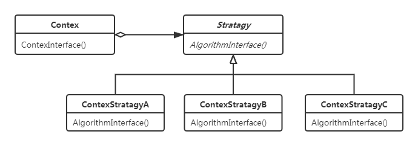

## 意图
定义一系列算法，把它们一个个封装起来，并且使它们可互相替换**（变化）**。该模式使得算法可独立于使用它的客户程序**（稳定）**而变化（扩展，子类化）。 

## 动机
- 在软件构建过程中，某些对象使用的算法可能多种多样，经常改变，如果将这些算法都编码到对象中，将会使对象变得异常复杂；而且有时候支持不使用的算法也是一个性能负担。
- 如何在运行时根据需要透明地更改对象的算法？将算法与对象本身解耦，从而避免上述问题？

## 结构

## 参与者

- Strategy（策略）
  - 定义所有支持的算法的公共接口。Contex使用这个接口来调用某ConcreateStrategy定义的算法。

- ConcreateStrategy（具体策略）
  - 以Strategy接口实现某具体算法。

- Context（上下文）
  - 用一个ConcreStrategy对象来配置。
  - 维护一个对Strategy对象的引用。
  - 可定义一个接口来让Strategy访问它的数据。
