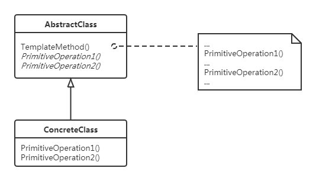

## 意图
定义一个操作中的算法的骨架（**稳定**），而将一些步骤延迟（**改变**）到子类中。使得子类可以不改变一个算法的结构即可重定义该算法的某些特定步骤。

## 动机
- 在软件构建过程中，对于某一项任务，它常常有**稳定**的整体操作结构，但各个子步骤却又很多**改变**的需求，或者由于固有的原因*（比如框架与应用之间的关系）*而无法和任务的整体结构同时实现
- 如何在确定稳定操作结构的前提下，灵活应对各个子步骤的变化或者晚期实现需求？

## 结构

## 参与者

- AbstractClass（抽象类）
  - 定义抽象的**原语操作(primitive operation)**，具体子类将重定义它们以实现一个算法的各步骤
  - 实现一个模板方法，定义算法的骨架。该模板方法不仅调用原语操作，也调用定义在抽象类或其他对象中的操作。
- ConcreateClass（具体类）
  - 实现原语操作以完成算法中与特定子类相关的步骤。

## 协作

- “别找我们，我们找你”。指父类调用子类的操作，而不是相反
- **钩子操作**。在父类的模板方法中调用钩子操作，子类可以重定义这个钩子操作。
